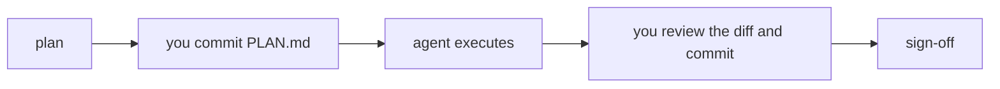

# Agentic AI for engineering research: own the work

Twenty minutes, eleven slides. Times are cumulative. The debrief at minute 55 is led by the presenter without slides. Speaker notes follow each slide in a collapsed block.

---

## 1. The question this hour answers (00:00)

**How do you delegate research work to an AI agent without delegating your scientific judgment?**

- The agent reads a repository, proposes, writes and runs code, debugs, evaluates, reports.
- You own the question, the plan, the evaluation, the conclusion.
- At the end you sign the result. Or you do not.

Notes

One sentence to open: the agent does the work, the researcher signs it. Everything today serves that sentence. Do not define terms yet; slide 3 does that.

---

## 2. What you will do today (00:01)

1. **Own it.** An interview turns a research question into a twenty-line plan. You commit it.
2. **Execute.** The agent carries out the plan. You review the diff and commit.
3. **Sign it.** You accept, qualify, or reject each claim the agent puts in front of you.

Forty minutes, in a prepared repository, with your own agent.

Notes

One minute. No numbers, no results. Just the three verbs. Slide 8 gives the task.

---

## 3. Four words (00:02)

| Word        | Means                                                              |
| ----------- | ------------------------------------------------------------------ |
| **Model**   | Generates text and proposed actions from context                   |
| **Agent**   | A model plus tools in a loop, pursuing a task                      |
| **Harness** | Runs the loop: tools, context, instructions, permissions, sessions |
| **Skill**   | A prompt in a file the harness loads on demand                     |

Today: the presenter uses **Claude Code**. You use whichever of **pi, Codex, Claude Code** you installed. Same repository, same skills, same rules.

Notes

Skills are just text. If a harness has no loader, you paste the file. Say that once so nobody feels behind. "ADE" and "IDE" are not on the slide on purpose; if asked, the categories overlap and the terms are not standardized.

---

## 4. Which model, how hard should it think (00:04)

- One hosted model today. Name and price verified this week.
- **Model choice** and **reasoning effort** are separate dials. Higher effort costs more time and money and does not guarantee a better answer.
- The same task at low and high effort: show both transcripts side by side.
- **Where the model runs is a third dial.** Hosted by a provider: strongest models, pay per token, your code and data leave the machine. Self-hosted on a lab or university server: open-weight models, one-time hardware cost, data stays inside. Local on your laptop: small open-weight models, free, private.

Reference: [Artificial Analysis, model cost comparison](https://artificialanalysis.ai/models#cost-tabs).

Notes

Two minutes. Open the Artificial Analysis cost tab live if the network allows; it puts price per million tokens and speed for every hosted model on one page, so participants can look up their own model.

On the third dial: the harnesses in the room all accept a local or self-hosted model through an OpenAI-compatible endpoint, so the choice is configuration, not a different tool. Say when each makes sense. Hosted when the task is hard and the data is public, as it is today. Self-hosted when the data cannot leave the institution or when a group runs enough tokens that hardware is cheaper than tokens. Local when privacy matters more than capability, or for routine edits. A small local model will struggle with today's sprint; that is a fair thing to try after the workshop, not during it. Verify the model name, effort settings, and price the week of delivery and write them here. One prepared comparison: a small refactor at low and at high effort, with wall-clock and cost on screen.

---

## 5. When the laptop is not enough (00:06)

- Three places, three questions: where does the **agent session** run, where does **inference** run, where does the **experiment code** run?
- SSH keys: protect the private key, register the public one through the approved process, verify the host. Never show a credential on screen.
- The agent writes the scheduler script. **Heavy work runs on compute nodes.** Approval before submission, and limits the scheduler enforces: resources, walltime, concurrent jobs, retries.
- Instructions do not enforce limits. Permissions and quotas do.
- Check what code, data, and logs reach the model provider.

**Live:** submit the job that regenerates today's embeddings for 5,991 proteins.

Notes

Three minutes including the live job. Submit, show the queue, move on. If the cluster is unreachable, show the saved job output and say so. The point is the boundary: participants stay on laptops; this is how the cache was made.

---

## 6. Git is the record. You hold it. (00:09)

- The repository starts at a tagged **baseline**.
- The agent **never commits**. You review `git diff` and commit when a step is done.
- **PLAN.md** is the contract: twenty lines, written before execution, committed by you, checked at the end.
- A claim in a report points at a commit and a file, not at a memory.

Notes

Two minutes. The commit is the act of ownership. If the agent could commit, the record would be the agent's. Revert, do not delete: a failed change stays visible as something that was tried.

---

## 7. Two skills: before and after (00:11)

**own-it**, before anything runs

- Interviews you: question, hypothesis, data, split, baseline, metric, the one change, the one follow-up check, scope, budget, what "improves" means, what gets written back.
- Two rounds at most, real alternatives, a recommendation each. Defaults it chose are listed for you to strike.
- Ends in `PLAN.md`. You commit it.

**sign-it**, before you submit

- At most ten items you would have to defend: claims with their files, decisions the agent made, contradictions, unverified statements.
- Each one: **accept, qualify, reject, don't know.**
- Nothing is computed during sign-it. It covers frozen work. Missing things go down as open.
- Not signing is a valid outcome, and it is written down.

For further exploration, two collections of research skills: [orchestra-research/AI-research-SKILLs](https://github.com/orchestra-research/AI-research-SKILLs), [imbad0202/academic-research-skills](https://github.com/imbad0202/academic-research-skills).

Notes

Two minutes. The officer analogy: someone who signs a document does not read every line, but knows every implication. Sign-it surfaces implications. Both skills use the harness's question panel when there is one; otherwise they ask in chat.

---

## 8. Today's task (00:13)

A model predicts Gene Ontology terms for *Flavobacterium* proteins. Some terms have over a thousand training examples, some fewer than twenty. The model treats every protein and every term alike, so it learns rare functions as "almost never." Suppose a reviewer writes: *class imbalance handling is completely missing.*

**Repository:** `go-imbalance-sprint`. 5,991 proteins, 393 Molecular Function terms, 349 precomputed features, a fixed split.

**Baseline:** scaler plus one-vs-rest logistic regression, unweighted. Micro F1 0.728 on test; rare terms 0.52.

**The one change:** balanced class weights, so each term's positives and negatives count equally.

**Decide before you run:** which number tells you whether it helped? Micro F1, macro F1, or rare-term F1. They will not agree.

Notes

Two minutes. The metric choice is the ownership moment of this case; own-it asks it, and the answer must be in PLAN.md before execution. Say what the trade is in one sentence: balanced weights find more rare functions and raise more false alarms. Name the three follow-up checks: recall versus precision by bucket, which terms go from never predicted to predicted, terms with under ten positives. Then thirty seconds of the presenter's completed run: PLAN.md, report, SIGNOFF.md.

---

## 9. From one experiment to a loop (00:15)

- [Karpathy's autoresearch](https://github.com/karpathy/autoresearch): an agent edits training code, runs a time-boxed experiment, reads a validation metric, keeps or discards, repeats.
- The researcher sets the objective, the evaluation, the editable scope, the budget, and the stopping rule. The agent runs the sequence and keeps the record.
- Optimizing a benchmark is not establishing a finding.

Notes

Today's sprint is one turn of that loop, with a human at both ends. Autoresearch removes the human from the middle turns, not from the ends. Keep permissions and quotas on; adopt the loop, not unrestricted execution.

---

## 10. Where this is going (00:17)

[Dan Kondratyuk, 15 Sep 2026](https://x.com/hyperparticle/status/2099861544481731058): a swarm of agents beat the state of the art on Karpathy's NanoChat benchmark in three days, with a harness built on a graph database, each iteration learning from the last, over 15,000 written entries.

Two recent papers put that in a frame:

- **A ladder of autonomy.** [*The Last AI Built by Humans*](https://arxiv.org/abs/2609.11873) (Duan et al.) describes recursive self-improvement in five stages: the agent executes an improvement a human chose; the agent chooses what to try; the agent decides what experience to gather; the agent adapts its own environment; the agent improves the improvement process itself. Today's sprint is stage one. Karpathy's loop is stage two. The swarm is stage two reaching for three.
- **The record is the engine.** [*Dream-RSI*](https://arxiv.org/abs/2609.14858) (Zheng et al.) treats the accumulated history of past attempts as a replay simulator: the agent rehearses new exploration strategies against what it already tried, cheaply and offline, before spending real compute. The 15,000 entries are not a log. They are the training data for the next round.

Every rung still needs someone to set the objective, own the evaluation, and sign. The scale is different. The need for a signer is not.

Notes

Two minutes. Three points in order.

First, place the room on the ladder. Own-it, execute, sign-it is stage one: a human chose the improvement, the agent executed it, a human signed. Autoresearch moves the choice of what to try into the loop; that is stage two. The Kondratyuk swarm adds a harness that learns across iterations, which is the beginning of stage three, the agent deciding what experience it needs.

Second, the mechanism. Dream-RSI's insight is that a complete, structured record of what was tried becomes a simulator: a new strategy can be scored against history before it is run. This is why the sprint insists that every number lives in a file and every decision in PLAN.md. A record kept for a signer is also a record a future loop can learn from. Sloppy records cannot be replayed.

Third, what does not change. Both papers end on the same open problems: who sets the objective, how evaluation stays honest when the agent is optimizing against it, and what counts as a finding rather than a benchmark win. Those are the researcher's, at every stage. The signer does not disappear as autonomy rises; the signer's job gets harder.

Both links are on the handout; the audience checks them.

---

## 11. HandsOn (00:19)

1. Open your harness in your clone of [go-imbalance-sprint](https://github.com/yusuf8834/go-imbalance-sprint).
2. Ask it: **"which skills do you have?"** It should name own-it and sign-it. If not, paste `skills/own-it/SKILL.md`.
3. Say **"own it."**

Blocked? Pair with a neighbor and follow on their screen.

Notes

One minute. Helpers circulate. Anyone whose setup fails pairs immediately; do not stall the room. Start the clock at 20:00.

